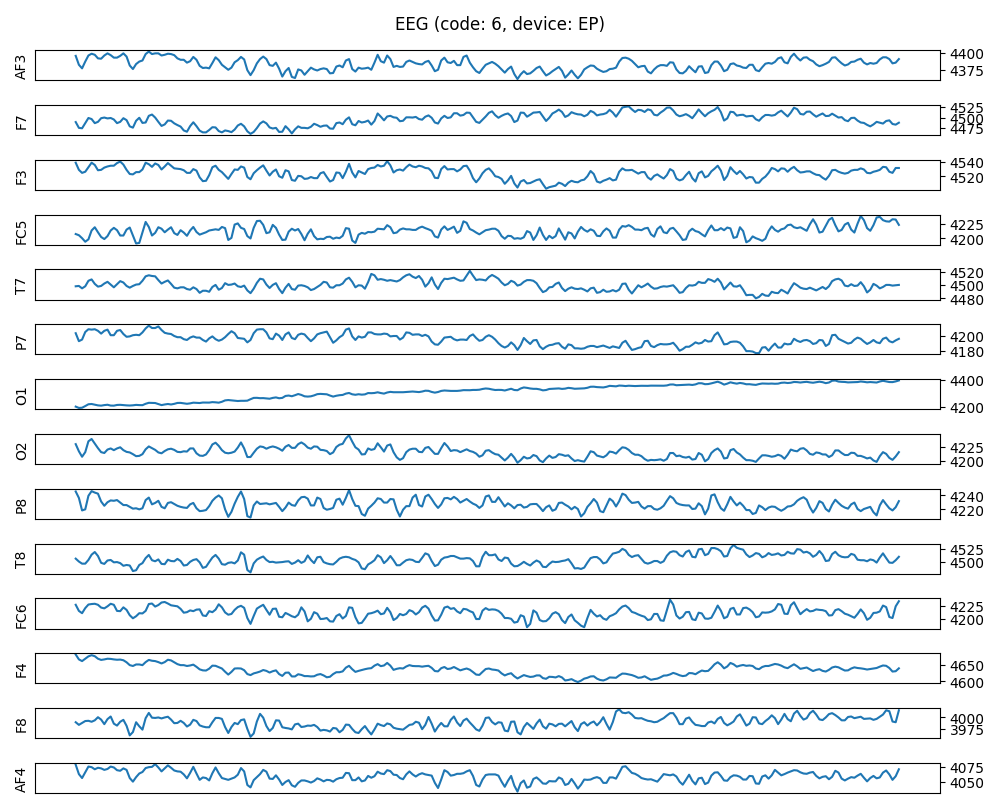
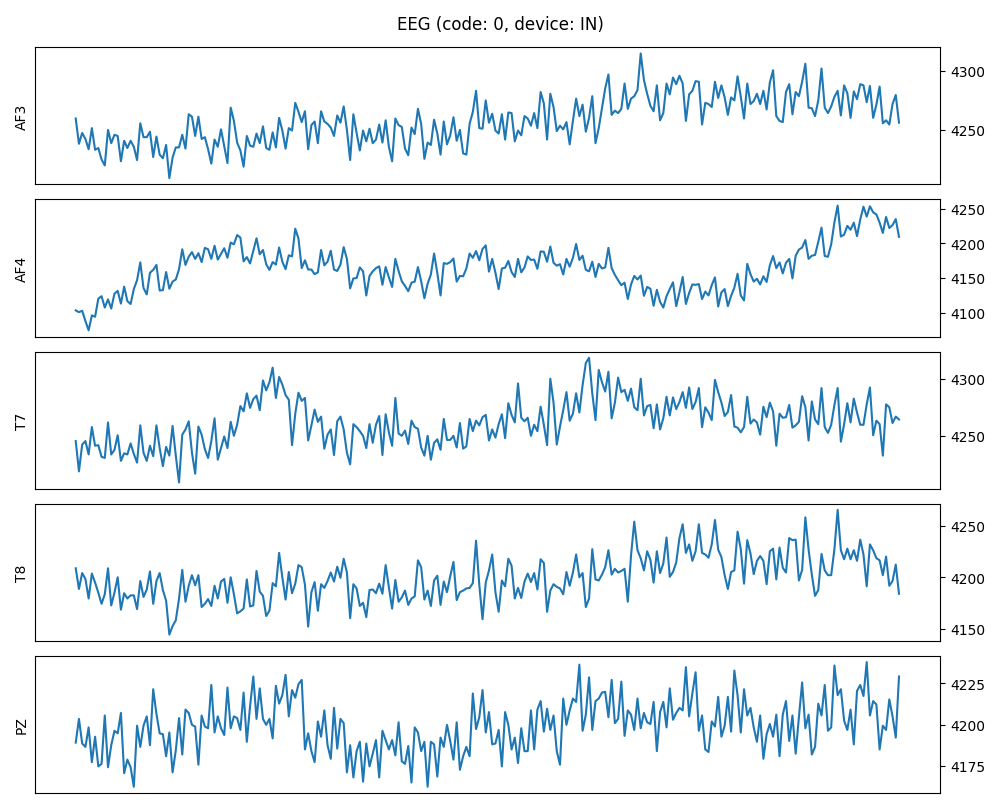
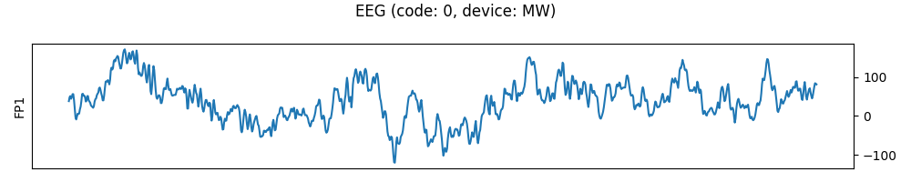

# 뇌전도 기록을 통한 시각 자극 판별
> Option A

## Members
- 박예영, 의예과 1학년, lina7124@hanyang.ac.kr
- 변서현, 의예과 1학년, sunnybyeon@hanyang.ac.kr

## I. Proposal
### Motivation

뇌전도(Electroencephalogram, EEG)는 비침습적으로 뇌파를 측정할 수 있는 기술로, 인간의 인지 과정을 이해하는 데 유용한 도구로 주목받고 있다. 최근에는 단순히 뇌의 상태를 모니터링하는 수준을 넘어, 뇌파 패턴으로부터 사람이 무엇을 보고 느끼고 생각하는지를 추론(prediction)하려는 연구들이 활발하게 진행되고 있다. 이러한 기술은 범죄 수사, 소비자 반응 기반 마케팅 분석, 중증 환자 의사소통 보조, 뇌-컴퓨터 인터페이스(Brain Computer Interface, BCI) 등 다양한 분야에서 활용될 수 있다.

하지만, 뇌파 기반의 시각 자극 예측 정확도는 여러 요인에 의해 좌우된다. 그중 “어떤 뇌 영역을 측정했는가”, 그리고 **“어떤 모델을 적용했는가”**는 정확도에 큰 영향을 미치는 핵심 요소이다. 뇌의 위치마다 시각 자극에 대한 반응 패턴이 다르기 때문에, 최적의 측정 부위를 선택하는 것은 예측 정확도 향상에 매우 중요하다. 또한 EEG는 시간적, 공간적 특징이 복잡하게 얽혀 있으므로, CNN, LSTM, CNN-LSTM과 같은 다양한 딥러닝 모델 중 어떤 것이 EEG 패턴의 특징을 잘 포착하는지도 알아보고 싶었다.

따라서 본 프로젝트에서는 숫자(0~9)를 보았을 때 기록된 FP1, AF3, AF4 EEG 데이터 셋을 활용하여,

(1) 각 뇌 위치별로 시각 자극 판별 정확도 어떻게 다른지,

(2) 각 모델(CNN, LSTM, CNN-LSTM)의 예측 정확도가 어떻게 달라지는지

직접 비교 분석하고자 한다.

### **What do you want to see at the end?**
뇌파 기반 시각 자극 예측 연구에서 가장 효과적인 부위와 모델이 무엇인지 알아내고자 하는 것이 본 프로젝트의 주요 목표이다. 

1) 각 뇌 위치별로 시각 자극 판별 정확도가 어떻게 다른지 판별해볼 것이다.

FP1, AF3, AF4 세 부위 각각의 EEG 데이터를 동일한 조건에서 학습시킨 후 각 부위별 Accuracy, Loss curves를 비교하고, 시각 자극 판별의 key가 되는 부위가 어디인지 알아낼 것이다.
어떤 부위가 숫자 자극을 가장 명확하게 반영하는지 파악하고, 시각 자극 인지에 가장 핵심적인 EEG 채널이 어디인지 알아낼 것이다.

2) 모델별(CNN, LSTM, CNN-LSTM) 분류 성능 비교

동일한 EEG 데이터셋에 대해 3가지 모델을 모두 적용해볼 것이다. 모델별 Accuracy, Loss를 비교하여, 시간적 패턴 분석에 사용되는 LSTM, 공간적 패턴 분석에 사용되는 CNN, 두 모델을 결합한 CNN-LSTM 중 어떤 구조가 EEG 패턴을 가장 잘 분석하는지 알아낼 것이다.

추가적으로, 각 모델이 어떤 면에서 강점을 보이는지도 분석해볼 것이다. 

3) 부위 × 모델 조합 중 최적의 성능을 나타내는 조합은 무엇인지 알아볼 것이다.

각 부위(FP1, AF3, AF4) × 각 모델(CNN, LSTM, CNN-LSTM)의 조합을 비교하여 가장 높은 정확도를 보이는 조합을 찾고, 향후 EEG 기반 연구에서 '어떤 부위를 어떤 모델로 분석해야 가장 정확한지'를 알아볼 것이다.

## Ⅱ. Datasets

[MindBigData: The "MNIST" of Brain Digits on Kaggle](https://www.kaggle.com/datasets/vijayveersingh/1-2m-brain-signal-data)

위의 링크에서 확인할 수 있는 MindBigData를 사용하였다. 이 데이터셋은 한 사람을 대상으로 0에서 9까지의 숫자를 보여줬을 때 2초간의 뇌전도(EEG) 데이터를 담고 있다. Emotive EPOC (EP), Emotiv Insight (IN), Interaxon Muse (MU), NeuroSky MindWave (MW)의 4개의 기기를 이용해 측정한 데이터이며, 각 기기별로 제공된 데이터의 수는 다음과 같다. 여기서 데이터 수는 하나의 숫자를 보여주는 사건인 이벤트(event)의 수가 아니라, 각 이벤트의 채널(channel, 뇌전도 측정 위치)별 데이터를 모두 개별 데이터로 간주한 숫자이다.

| 기기 | 데이터 수 |
| ---- | --------- |
| EP   | 910,476   |
| IN   | 65,250    |
| MU   | 163,932   |
| MW   | 67,635    |

각 기기별로 다른 조합의 채널에서 데이터가 측정되었으며, 각 기기의 데이터 예시를 아래 사진에 나타내었다. 코드(code)는 대상자에게 보여준 숫자를 의미한다.






데이터 중 숫자가 아닌 자극을 의미하는 `-1`의 코드를 가진 데이터는 제외하였다. 또, 한 개의 기기에서만 측정한 채널은 제외하여 AF3, AF4, FP1의 3개 채널 데이터만 활용하였다. 이들 데이터의 코드별 분포는 다음과 같다.


각 데이터는 채널별로 분류하여 다음의 전처리 과정을 거쳤다. 뇌전도 데이터가 같은 길이(시간 간격)로 제공되지 않아, 모델에 따라 필요 시 데이터의 마지막에 0을 추가해 길이를 통일하는 과정이 있었다.

```python
def normalize(df):
    devices = df["device"].unique()
    for device in devices:
        df_device = df[df["device"] == device]
        all_amplitude = df_device["data"].explode().to_list()
        mean = np.mean(all_amplitude)
        std = np.std(all_amplitude)
        df.loc[df["device"] == device, "data"] = (df_device["data"] - mean) / std
    return df


def add_padding(df):
    max_size = max(df["size"].unique())
    df.loc[:, "data"] = df["data"].apply(
        lambda eeg: np.pad(eeg, (0, max_size), mode="constant", constant_values=0)[
            :max_size
        ]
    )
    return df, max_size
```

데이터 처리 및 시각화와 관련된 코드는 [dataset.py](./dataset.py)에서 확인할 수 있다.
