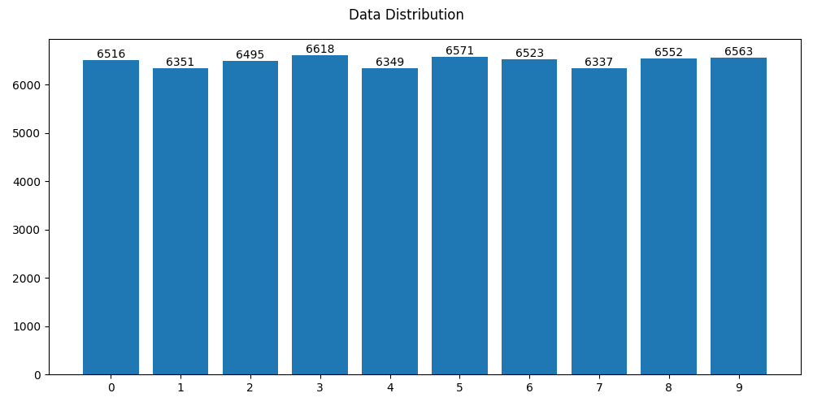
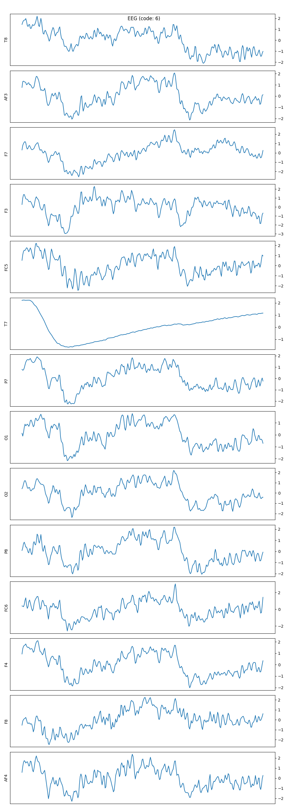
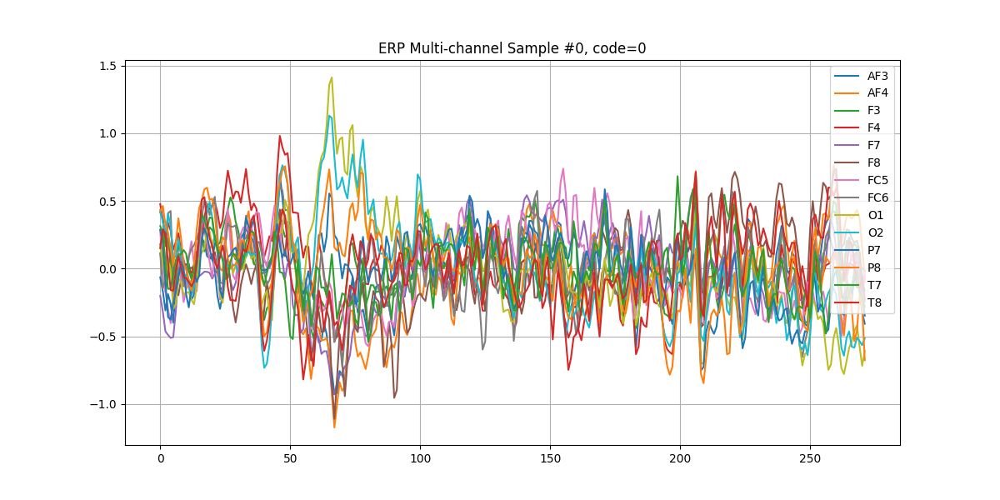
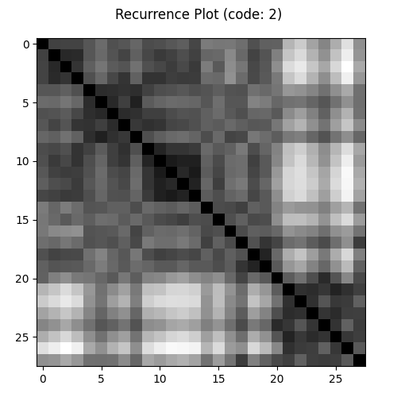

# 뇌전도 기록을 통한 시각 자극 판별
> Option A

## Members
- 박예영, 의예과 1학년, lina7124@hanyang.ac.kr
- 변서현, 의예과 1학년, sunnybyeon@hanyang.ac.kr

## Ⅰ. Proposal
### Motivation

뇌전도(Electroencephalogram, EEG)는 비침습적으로 뇌파를 측정할 수 있는 기술로, 인간의 인지 과정을 이해하는 데 유용한 도구로 주목받고 있다. 최근에는 단순히 뇌의 상태를 모니터링하는 수준을 넘어, 뇌파 패턴으로부터 사람이 무엇을 보고 느끼고 생각하는지를 추론(prediction)하려는 연구들이 활발하게 진행되고 있다. 이러한 기술은 범죄 수사, 소비자 반응 기반 마케팅 분석, 중증 환자 의사소통 보조, 뇌-컴퓨터 인터페이스(Brain Computer Interface, BCI) 등 다양한 분야에서 활용될 수 있다.

EEG는 시간적, 공간적 특징이 복잡하게 얽혀 있으므로, CNN, LSTM과 같은 다양한 딥러닝 모델 중 어떤 것이 EEG 패턴의 특징을 잘 포착하는지 알아보고자 하였다. 또, ERP(Event-Related Potential)을 추출한 후 LSTM의 입력값으로 넣는 방식이 정확도를 개선할 수 있는지도 비교해보고자 하였다.

따라서 본 프로젝트에서는 숫자(0~9)를 보았을 때 기록된 EP EEG 데이터 셋을 활용하여 각 모델(CNN,EEG-LSTM, ERP-LSTM)의 예측 정확도가 어떻게 다른지 비교하고자 한다.

### What do you want to see at the end?
뇌파 기반 시각 자극 예측 연구에서 가장 효과적인 모델이 무엇인지 알아내고자 하는 것이 본 프로젝트의 주요 목표이다. 

동일한 EEG 데이터셋에 대해 3가지 모델을 모두 적용해볼 것이다. 모델별 Accuracy, Loss를 비교하여, 시간적 패턴 분석에 사용되는 LSTM, 공간적 패턴 분석에 사용되는 CNN 중 어떤 구조가 EEG 패턴을 가장 잘 분석하는지 알아낼 것이다. 또, ERP를 이용하는 것이 EEG를 활용하는 것보다 학습 정확도가 높은지도 판별해볼 것이다.

추가적으로, 각 방식이 어떤 면에서 강점을 보이는지도 분석해볼 것이다. 

## Ⅱ. Datasets

[MindBigData: The "MNIST" of Brain Digits on Kaggle](https://www.kaggle.com/datasets/vijayveersingh/1-2m-brain-signal-data)

위의 링크에서 확인할 수 있는 MindBigData를 사용하였다. 이 데이터셋은 한 사람을 대상으로 0에서 9까지의 숫자를 보여줬을 때 2초간의 뇌전도(EEG) 데이터를 담고 있다. Emotive EPOC (EP), Emotiv Insight (IN), Interaxon Muse (MU), NeuroSky MindWave (MW)의 4개의 기기를 이용해 측정한 데이터이며, 각 기기별로 제공된 데이터의 수는 다음과 같다. 여기서 데이터 수는 하나의 숫자를 보여주는 사건인 이벤트(event)의 수를 의미한다.

| 기기 | 데이터 수 |
| ---- | --------- |
| EP   | 65,034    |
| IN   | 13,050    |
| MU   | 40,983    |
| MW   | 67,635    |

각 기기별로 다른 채널에서 데이터가 측정되었기에, 데이터 수가 가장 많은 EP 데이터만을 이용하여 진행하였다. EP는 AF3, AF4, F3, F4, F7, F8, FC5, FC6, O1, O2, P7, P8, T7, T8의 14개 채널에서 측정된 데이터를 담고 있다. 채널 기호는 10-20 시스템을 이용해 나타낸 것이다.

데이터 중 숫자가 아닌 자극을 의미하는 `-1`의 코드를 가진 데이터는 제외하였다. 데이터의 코드별 분포는 다음과 같다.



데이터의 공통적인 전처리 과정은 다음과 같다.

먼저, 모든 데이터는 z-score 정규화를 거쳤다.
```python
def normalize_signal(sig, eps=1e-8):
    sig = sig.astype(float)
    mean = sig.mean()
    std = sig.std()
    if std < eps:
        return sig - mean
    return (sig - mean) / std
```
또한, 각 데이터별로 EEG 길이를 선형보간을 통해 가장 긴 데이터에 맞추어 통일하였다.
```python
def resize_signal(sig, target_len):
    cur = len(sig)
    x_old = np.linspace(0, 1, cur)
    x_new = np.linspace(0, 1, target_len)
    return np.interp(x_new, x_old, sig)
    return df, max_size
```

전처리 과정을 거친 데이터 중 하나를 예시로 다음 그래프에 표현하였다. 코드(code)는 대상자에게 보여준 숫자를 의미한다.



이 외 각 모델별로 필요한 전처리는 아래에 자세히 설명하였다.

데이터 처리 및 시각화와 관련된 코드는 [preprocessing.py](./preprocessing.py)와 [visualize.py](./visualize.py)에서 확인할 수 있다.

위의 2개 그래프를 출력하기 위해서는 아래 명령어를 사용할 수 있다.
```bash
python visualize.py
```


## Ⅲ. Methodology

### 모델
본 프로젝트에서는 ERP-LSTM, EEG-LSTM, CNN with Recurrence Plot의 3가지 모델을 구축하였다.

각 모델의 정의 코드는 [models.py](./models.py)에서 확인할 수 있다.

#### ERP-LSTM
LSTM(Long Short-Term Memory)은 RNN(Recurrent Neural Network)의 하나로, 시계열 데이터를 분석하는 데 가장 적합하다고 꼽히는 모델 중 하나이다. RNN은 시계열 데이터의 값을 받아 각 시점마다 내부 상태(internal state, hidden state)를 업데이트하는 방법으로 진행함으로써 시계열 데이터의 특성을 잘 반영한다. LSTM은 이러한 기본 RNN에 셀(cell state)을 추가하여 발전시킨 형태이다.

ERP(Event Related Potential)는 EEG 데이터에서 유의미한 feature을 추출하기 위한 방법 중 하나이다. 본 프로젝트에서는 Zheng et al. (2020)를 참고하여 ERP를 계산하였다. 여러 시행의 데이터를 하나의 그룹으로 묶은 뒤, 각 시점의 데이터를 평균내면 ERP 값을 구할 수 있다. 이 경우 유의미한 시점의 데이터는 모두 비슷한 수를 나타낼 것이기 때문에 평균도 그 값 주변에서 형성될 것이다. 그러나, 유의미하지 않은 시점의 데이터는 무작위로 다양하게 형성될 것이기 때문에 평균을 구하면 0에 가깝게 나타날 것으로 예상할 수 있다. 이러한 특징을 이용하여 유의미한 값과 그렇지 않은 값을 구분하는 것이 ERP이다.

본 프로젝트의 첫 번째 모델은 이러한 방법으로 구한 ERP를 LSTM에 적용한 것이다.

다음은 ERP 데이터 중 하나를 그래프로 나타낸 것이다.



ERP를 계산하는 코드는 다음과 같다.
```python
def extract_erp(df, n_trials_per_erp=12, min_trials=8):
    erp_list = []

    for code in sorted(df["code"].unique()):
        subset = df[df["code"] == code].copy()

        signals = list(subset["data_arr"])
        idx = 0

        while idx < len(signals):
            chunk = signals[idx : idx + n_trials_per_erp]
            if len(chunk) < min_trials:
                break

            erp_signal = np.array(chunk).mean(axis=0)

            erp_list.append(
                {"code": int(code), "signal": erp_signal, "length": len(erp_signal)}
            )

            idx += n_trials_per_erp

    return pd.DataFrame(erp_list)
```

ERP-LSTM 모델은 다음과 같이 정의하였다.
```python
class ERPLSTM(torch.nn.Module):
    def __init__(self):
        super().__init__()

        self.lstm = torch.nn.LSTM(
            input_size=14, hidden_size=64, num_layers=2, dropout=0.8, batch_first=True
        )
        self.fc = torch.nn.Linear(64, 10)
        self.dropout = torch.nn.Dropout(0.5)

        self.activation = torch.nn.ReLU()

    def forward(self, x):
        _, (h_n, _) = self.lstm(x)
        h_last = h_n[-1]
        x = self.activation(h_last)
        x = self.dropout(x)
        x = self.fc(x)

        return x
```

#### EEG-LSTM
두 번째 모델은 앞선 ERP-LSTM 모델과 유사하지만, ERP를 계산하지 않고 EEG 데이터를 그대로 LSTM에 적용한 것으로 설정하였다.

EEG-LSTM 모델은 다음과 같이 정의하였다.
```python
class EEGLSTM(torch.nn.Module):
    def __init__(self):
        super().__init__()

        self.lstm = torch.nn.LSTM(
            input_size=14, hidden_size=32, num_layers=2, dropout=0.5, batch_first=True
        )
        self.fc = torch.nn.Linear(32, 10)
        self.dropout = torch.nn.Dropout(0.5)

        self.activation = torch.nn.ReLU()

    def forward(self, x):
        _, (h_n, _) = self.lstm(x)
        h_last = h_n[-1]
        x = self.activation(h_last)
        x = self.dropout(x)
        x = self.fc(x)

        return x
```

#### CNN with Recurrence Plot
CNN(Convolutional Neural Network)은 이미지 분석 분야에서 가장 주목받는 모델 중 하나이다. CNN은 필터(filter)라고도 불리는 커널(kernel)로 input 데이터를 지나가며 각 지점에서의 합성곱으로 output을 계산한다.


(사진 출처: [https://www.kaggle.com/code/aayusmaanjain/basics-of-cnn-with-pytorch-lightning](https://www.kaggle.com/code/aayusmaanjain/basics-of-cnn-with-pytorch-lightning))

이러한 방법은 커널의 값을 조절하여 이미지의 특정 패턴을 파악하는 데 적합하기에 이미지 분석에서 좋은 결과를 보이는 경우가 많다.

시계열 데이터를 분석하는 접근 방법 중 하나는 시계열 데이터를 그래프, 이미지로 표현한 뒤 이를 input으로 하는 이미지 모델을 이용하는 것이다. 본 프로젝트에서는 EEG 데이터를 recurrence plot으로 표현한 뒤, 이 그래프를 CNN으로 분석하는 방법을 택하였다. Recurrence plot은 시계열 데이터에서 각 시점의 데이터 사이의 차이를 시각화한 그래프이다. `n * n` matrix로 나타내는데, 이 matrix의 `(i, j)`에는 `i` 시점의 데이터와 `j` 시점의 데이터 간의 거리가 담긴다. Recurrence plot을 이용하면 어느 시점의 데이터들이 유사한지, 즉 어떤 시점 사이에서 반복이 일어났는지를 파악하여 패턴을 분석할 수 있다.

다음은 recurrence plot 중 하나를 예시로 제시한 것이다.



EEG 데이터로부터 recurrence plot을 계산하는 코드는 다음과 같이 구현하였다.
```python
def to_recurrence_plot(data):
    plots = []
    for channel_data in data:
        data_length = len(channel_data)

        plot = np.zeros((data_length, data_length))
        for i in range(data_length):
            for j in range(data_length):
                plot[i, j] = np.abs(channel_data[i] - channel_data[j])

        plots.append(plot)

    result = np.sum(plots, axis=0)

    # normalizing the plot
    result = (result - result.min()) / (result.max() - result.min())

    return result
```

CNN 모델은 다음과 같이 정의하였다.
```python
class CNN(torch.nn.Module):
    def __init__(self):
        super().__init__()

        self.conv1 = torch.nn.Conv2d(in_channels=1, out_channels=1, kernel_size=5)
        self.covn2 = torch.nn.Conv2d(in_channels=1, out_channels=1, kernel_size=5)

        self.fc = torch.nn.Linear(1 * 4 * 4, 10)

        self.dropout = torch.nn.Dropout(0.75)

        self.activation = torch.nn.ReLU()
        self.pool = torch.nn.MaxPool2d(kernel_size=2)

    def forward(self, x):
        x = torch.unsqueeze(x, 1)  # (batch_size, 28, 28) -> (batch_size, 1, 28, 28)
        x = self.activation(
            self.conv1(x)
        )  # (batch_size, 1, 28, 28) -> (batch_size, 1, 24, 24)
        x = self.pool(x)  # (batch_size, 1, 24, 24) -> (batch_size, 1, 12, 12)

        x = self.dropout(x)

        x = self.activation(
            self.conv1(x)
        )  # (batch_size, 1, 12, 12) -> (batch_size, 1, 8, 8)
```

### 모델 훈련

아래 명령어를 실행하여 모델을 훈련시킬 수 있다.
```bash
python project.py
```

다음과 같이 각 모델별로 필요한 데이터셋을 불러왔다. train 데이터와 validation 데이터는 4:1의 크기를 같도록 하였다. ERP의 경우, 12개 데이터를 한 묶음으로 하여 하나의 ERP를 추출하므로 이를 고려해서 먼저 전체 데이터를 48:1의 크기로 분리하고, train 데이터에서만 ERP를 추출하여 결과적으로 4:1의 데이터 크기 비를 갖도록 하였다.
```python
erp_train_dataset = ERPDataset(X_ERP_train, Y_ERP_train)
erp_val_dataset = ERPDataset(X_ERP_val, Y_ERP_val)
erp_train_dataloader = torch.utils.data.DataLoader(
    erp_train_dataset, batch_size=batch_size, shuffle=True
)
erp_val_dataloader = torch.utils.data.DataLoader(
    erp_val_dataset, batch_size=batch_size, shuffle=True
)
...
```

이후 각 모델별로 훈련을 진행하였다. 훈련 루프는 아래에 간략히 나타내었으며, [train.py](./train.py)에서 자세히 확인할 수 있다.
```python
for epoch in range(epochs):
    # Training
    model.train()
    train_loss, train_acc = 0, 0

    for data, label in train_dataloader:
        data = data.to(device)
        label = label.to(device)

        # 초기화
        optimizer.zero_grad()

        # prediction 및 loss 계산
        prediction = model(data)
        loss = loss_function(prediction, label)
        train_loss += loss.item()
        train_acc += get_correct_count(prediction, label)

        # Backpropagation
        loss.backward()
        optimizer.step()
    ...
```

훈련에 있어 손실 함수(loss function)는 Cross Entropy Loss를 이용하였으며, 옵티마이저(optimizer function)로는 Adam을 이용했다. 각 모델별로 사용한 learning rate, weight decay는 다음과 같다.
```python
# ERP-LSTM
optimizer_erp_lstm = torch.optim.Adam(
    model_erp_lstm.parameters(), lr=0.000007, weight_decay=1e-5
)

# EEG-LSTM
optimizer_eeg_lstm = torch.optim.Adam(
    model_eeg_lstm.parameters(), lr=1e-5, weight_decay=1e-6
)

# CNN with Recurrence Plot
optimizer_cnn = torch.optim.Adam(model_cnn.parameters(), lr=1e-6, weight_decay=1e-6)
```


## Ⅳ. Model evaluation & Results
### 평가 지표

각 모델에 대해 Accuracy와 Loss를 주요 평가 지표로 사용하였다.

데이터가 숫자 자극 10개(0~9)에 대한 EEG 또는 ERP 신호로 구성되어 있으므로, 아무 정보도 학습하지 못한 완전 랜덤 분류의 기대 정확도는 10%이다.
따라서 결과 해석 시, 10% 이하는 정보 학습을 하지 못한 상태, 10%를 소폭이라도 안정적으로 상회하는 것은 신호 내에 존재하는 미약한 패턴을 포착하고 있는 상태라고 판단하였다. 

### CNN
(1) Accuracy Function


Train Accuracy는 약 9.8%~10.3% 범위에서 증가하는 경향성을 띠었다. 
Validation Accuracy는 Epoch 10까지는 약 9.8%~10.2% 범위에서 증가하였고, 이후부터 감소하다가 약 10.1%로 일정한 수평선 형태를 보였다.

즉, CNN 모델의 분류 정확도는 거의 향상되지 않았음을 알 수 있었다. 

(2) Loss Funcion


Train loss는 약 2.445%에서 2.315%까지 감소하였으며, 
Validation loss는 약 2.322%에서 2.314%로 완만하게 감소하였다.

(3) 해석

위의 결과를 통해, 패턴 학습이 어느 정도 진행되긴 했지만 정확도 개선으로 이어지기는 어려운 수준임을 알 수 있었다.
결과를 보면, trainloss와 validation loss의 차이가 매우 작으며, 정확도도 낮은 수준에 머물러 있다.
CNN 구조만으로는 자극 후 이어지는 복잡한 ERP 데이터에 대한 시간적 정보를 활용하기 힘들다는 점을 알 수 있었다. 즉, 과적합보다는 underfitting 문제가 있었을 것이라고 추론할 수 있다.

### EEG-LSTM (raw EEG data)

(1) Accuracy Function


Train accuracy는 약 10.0% ~ 11.6%까지 증가하는 경향성을 보였다.
Validation accuracy는 약 9.9%에서 12.0% 이상까지 상승하였으며, 특히 20 Epoch 이후부터는 train보다 validation accuracy가가 항상 높게 유지되었다.

이는 LSTM이 시간 순서가 있는 raw EEG 신호의 패턴을 포착하고 있으며, CNN보다 일관된 성능 향상을 만들어내고 있음을 의미한다.

(2) Loss Funcion


Train loss는 약 2.304%에서 2.297%로 감소하였다.
Validation loss는 전체 구간에서 train loss보다 낮았으며, 비슷한 기울기로 감소하였다.

(3) 해석

raw EEG의 시간 패턴을 활용한 LST 모델은 CNN보다 나은 성능을 보여주었다. 
그러나 여전히 정확도는 12% 수준으로 관찰되었고,
single-trial EEG가 가지는 근본적인 한계(노이즈, 피험자 차이)를 극복하기에는 부족하다는 점을 알 수 있었다. 

### ERP-LSTM 

(1) Accuracy Function


Train accuracy는 일정하지는 않지만, 약 9.2% ~ 11%로 증가하는 경향을 보였다. 
Validation accuracy는 약 10.3%부터 11.8%까지 일관되게 상승하다가, Epoch 40부터 약 11.3%까지 소폭 감소하였다. 
약 Epoch 20부터는 train보다 validation accuracy가 일관되게 높게 관찰되었다. 

EEG-LSTM과 비슷한 수준의 train accuracy와 val accuracy를 보여주었다. 

(2) Loss Funcion


Train loss는 약 2.307%부터 2.303으로 감소하는 경향을 띠었다. 
Validation loss는 약 2.311%에서 2.305%로 지속적으로 감소하였다. 

CNN 대비 loss 감소 폭은 작지만, loss 곡선의 기울기가 거의 일정하게 관찰되었다. 
이를 통해, ERP 추출 과정을 거치면서 trial 간 변동성이 줄어들었고, 모델이 과적합이나 과소적합 중 한 쪽으로도 심하게 치우치지 않고 안정적으로 학습한 상태임을 추론할 수 있다.

(3) 해석

결과를 통해, ERP가 노이즈를 줄여서 LSTM 학습을 안정화시켰음을 알 수 있었다. 
raw EEG-LSTM에 비해 Epoch에 따른 loss 곡선의 변동성이 낮은 것을 통해, ERP 생성 과정이 노이즈와 개별 trial 간의 변동성을 줄여주었음을 확인할 수 있었다. 

## Ⅴ. Discussion

### 결과 분석 및 정리

세 모델의 정확도는 모두 10~12% 수준으로 관찰되었다.

본 프로젝트에서는 적은 채널 수로부터 얻은 single-trial data를 활용했으며, EEG data는 다른 종류의 data에 비해 노이즈와 trial 간 변동성이 크다. 
학습이 어려운 data type에서 1–2% 정도의 성능 향상이 나타났으며, 특히 epoch 전체에 걸쳐 일관되게 val accuracy가 train보다 높거나 비슷하게 유지되는 패턴을 통해 모델이 신호를 조금이나마 학습하고 있음을 짐작할 수 있었다. 

### 한계점 고찰

EEG data는 근육 움직임, 눈 깜빡임 등 다양한 artifact에 매우 민감하다.
trial을 평균내지 않고 단일 trial을 사용하면 EEG 신호는 노이즈에 묻혀서 class 간 차이가 거의 없을 것이다. 

본 프로젝트에서는 기본적인 정규화와 ERP 평균화만 적용했으며, 주파수 대역 필터링, 공간 필터링(CSP), artifact 제거(ICA) 등 고도의 EEG 전처리 기법을 활용하지 못했다.
이로 인해 모델이 EEG 신호보다 노이즈와 혼합된 신호를 학습해야 하는 문제가 생겼을 수 있다. 

마지막으로, 과적합을 피하기 위해 hidden size와 layer 수를 제한했고, dropout도 강하게 설정했다.
그 결과, 과적합은 거의 나타나지 않았지만 반대로 데이터의 복잡한 패턴을 충분히 고려하지 못하는 underfitting 상태에 머물렀을 가능성이 있다.

### 개선 방안

주파수 대역 필터링, 공간 필터링(CSP), artifact 제거(ICA) 등을 통해 신호의 SNR(Signal-to-Noise Ratio)을 높임으로써 LSTM/CNN 모델의 성능을 유의미하게 향상할 수 있을 것이라 생각한다. 
또, CNN-LSTM 하이브리드 구조를 사용한다면 데이터를 현재보다 더 풍부하고 입체적으로 활용할 수 있을 것이다. 
LSTM에 attention layer를 추가함으로써 특정 시간 구간의 중요도를 모델이 스스로 학습하도록 만드는 방식도 성능 향상에 도움이 될 것이다. 

### Conclusion

본 프로젝트에서는 CNN, EEG-LSTM, ERP-LSTM 세 가지 딥러닝 구조를 이용하여 시각 자극(숫자 0~9)을 분류해보았다. 

시간 정보를 활용하지 못하는 CNN은 random 분류 수준에 머물렀다. 
반면, LSTM 기반 모델들은 1–2%p 수준이지만 안정적인 정확도 향상을 보여주었으며, 이를 통해 EEG 신호에서는 시간적 패턴이 분류에 핵심적인 정보임을 확인할 수 있었다.
ERP data에 LSTM을 적용한 ERP-LSTM 모델은 raw EEG data를 활용했을 때보다 상대적으로 안정적인 학습 곡선과 일반화 성능을 보여주었다. 

절대적인 정확도는 낮지만, single-trial EEG가 가진 본질적인 데이터 특성의 한계도 영향을 미쳤을 것이라고 생각한다. 
